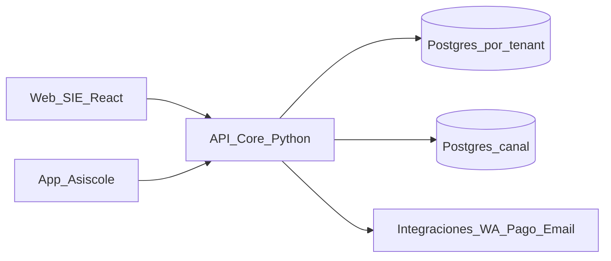

# Documento base — Reestructuración del SIE (Asiscole)

**Versión:** 0.1  
**Fecha:** 2026-09-15  
**Audiencia:** producto + técnico  
**Horizonte:** 3–6 meses (base para crecimiento: matrícula y más módulos)  
**Enfoque:** evolución multi-colegio (Jean Piaget, Asis Academy y futuros), no reescritura big-bang.

---

## 1. Propósito

Este documento fija una **línea base** para reestructurar el Sistema de Incidencias Escolares (SIE) y convertirlo en una plataforma escolar más completa (asistencia, disciplina, familia, matrícula, cobranza, académico), con:

- Backend de dominio claro (ya no solo el navegador hablando a tablas).
- Criterio de **lenguaje y stack**.
- Mapa de **módulos actuales y futuros**.
- **Integraciones** típicas de sistemas escolares y cómo encajan en Asiscole.

No incluye implementación ni migración paso a paso de código.

---

## 2. Situación actual (mapa corto)

| Capa | Tecnología | Rol hoy |
|------|------------|---------|
| Web SIE (staff / tutor / docente) | React 18 + Vite + TypeScript + Tailwind | Escáner, listas, reportes, citas, admin |
| Portal padres (web) | React (mismas apps) | Consulta limitada |
| Datos por colegio | Supabase Postgres + RLS + RPC | Estudiantes, llegadas, incidencias, talleres, etc. |
| App móvil apoderados | Flutter + canal Django | Avisos, push, confirmaciones, notas (parcial) |
| Mensajería / WA | OpenWA / WPPConnect / Meta (según colegio) + ingest canal | Llegadas, incidencias, citas, pensiones |

**Módulos ya vivos (en distinto grado de madurez):**

- Asistencias / control de llegadas y salidas (clase).
- Incidencias + catálogo de faltas + reincidencia.
- Citas con padres.
- Talleres (asistencia aparte de clase).
- Pensiones (aviso / estado; no cobro completo).
- Notas semanales (parcial, vía canal).
- Auditoría y roles staff (Admin, Tutor, Docente, Director, Padre).

**Dolor estructural actual:**

- Reglas de negocio repartidas entre **cliente React**, **RPC/triggers SQL** y **Django del canal**.
- El escáner depende de red + PostgREST; fallos en hora pico generan “Sin registrar”.
- Cada colegio es un proyecto Supabase; el canal centraliza solo mensajería/app.
- Matrícula / ficha completa / libretas oficiales aún no son el núcleo del producto.

---

## 3. Arquitectura objetivo

Principio: el navegador y la app **no escriben reglas críticas directo a tablas**. Pasan por una **API Core** que valida permisos, audita y orquesta integraciones.

**Capas:**

1. **Clientes:** Web SIE (React) + App padres (Flutter).
2. **API Core:** autenticación de sesión staff/padre, estudiantes, asistencia, incidencias, citas, matrícula, pensiones, reportes.
3. **Datos colegio:** Postgres por tenant (seguir el modelo actual de un proyecto/BD por colegio al inicio).
4. **Datos canal:** Postgres central (apoderados, mensajes, push, sesiones app) — ya existe.
5. **Workers / colas:** envíos WA, push, conciliación, exports pesados.
6. **Supabase (transición):** puede permanecer como Auth + Storage + Realtime al inicio; PostgREST se va apagando módulo a módulo en escrituras críticas.

---

## 4. Backend y lenguaje — recomendación

### Recomendación principal

**API en Python + Postgres + front React (TypeScript).**

Dentro de Python, la elección fina:

| Opción | Cuándo | Nota |
|--------|--------|------|
| **Django (+ DRF)** | Default recomendado | Ya hay canal Django, admin, ORM, Celery, permisos. Ideal para matrícula, reportes, paneles internos. |
| **FastAPI** | Si se parte API “verde” muy delgada | Excelente tipado/OpenAPI; hay que armar más pieza a pieza (auth admin, jobs). |

**Decisión de este documento:** arrancar **API Core en Django (DRF)** alineada al canal, o **extender el monolito canal** con apps de dominio escolar por tenant — evitando dos lenguajes de servidor.

### Por qué Python / Django

- Dominio escolar = reglas, estados, reportes Excel/PDF, permisos → ORM + servicios de dominio.
- El equipo ya opera Django en el canal (`app_asiscole`).
- Un solo lenguaje de backend reduce costo operativo (deploys, errores, onboarding).
- Ecosistema maduro para colas (Celery), auth, auditoría, exports.

### Alternativas descartadas como default

| Stack | Por qué no es el default |
|-------|---------------------------|
| **Node / NestJS** | Válido si el equipo fuera solo TypeScript; duplicaría backend junto al canal Django. |
| **Laravel / PHP** | Común en colegios PE, pero introduce un tercer ecosistema respecto al canal actual. |
| **Solo Supabase + Edge Functions** | Escala mal para matrícula compleja, reportes pesados y orquestación multi-integración. |
| **Big-bang microservicios** | Prematuro para el tamaño del equipo; preferir modular monolito + workers. |

### Front

Mantener **React + TypeScript + Vite** para el SIE web. No reescribir en otro framework en esta fase.

---

## 5. Módulos actuales → cómo reestructurarlos

| Módulo | Hoy | En la reestructuración | Riesgos a cuidar |
|--------|-----|------------------------|------------------|
| **Asistencias / llegadas** | Insert desde escáner vía Supabase; UI optimista | API `POST /asistencias/llegadas` + cola offline en cliente; estado calculado en servidor | Hora pico, red inestable, modo Taller vs Clase |
| **Incidencias** | Cliente + RPC + confirmación app | API de creación/cierre; canal solo notifica/confirma | Idempotencia, evidencias Storage |
| **Citas con padres** | Tablas colegio + aviso app | API citas + plantillas de mensaje | Alcance APAFA / salón / individual |
| **Talleres** | Tabla `taller_llegadas` separada | Módulo explícito; no mezclar con llegada de clase | Confusión de modo en el escáner |
| **Portal / App** | Canal Django + ingest | App habla a API Core (o BFF del canal que delega) | Sesión única, push, vínculo teléfono |
| **Pensiones** | Estado / aviso parcial | Dominio cobros + conciliación | No bloquear asistencia por deuda (política actual) |
| **Notas** | Parcial en canal | Módulo académico en API + proyección a app | Privacidad, periodos, escala |

---

## 6. Qué agregar (roadmap de producto)

Orden sugerido (valor de negocio × dependencia técnica):

### Prioridad alta (3–6 meses)

1. **Matrícula / ficha del alumno**  
   Datos personales, apoderados, documentos, estado (preinscrito / matriculado / retirado), año lectivo, sección.
2. **Pensiones / cobranza completa**  
   Cronograma, estados de pago, conciliación bancaria o pasarela, recibos, avisos (app/WA/email).
3. **Calificaciones / libreta**  
   Ampliar notas semanales → periodos, áreas, consolidado, export PDF.
4. **Comunicaciones unificadas**  
   Una bandeja de “salidas” (WA, push, email) con plantillas, deduplicación y auditoría.

### Prioridad media

5. **Horarios y carga docente** (quién enseña qué salón / hora).  
6. **Reportes oficiales / export tipo SIAGIE** (Excel validados, versionados por año).  
7. **Justificaciones y faltas masivas** con flujo de aprobación.

### Prioridad fase 2+

8. Inventario / biblioteca / enfermería.  
9. RRHH docentes (asistencia staff, permisos).  
10. Aula virtual / sync Classroom (opcional).

---

## 7. Integraciones típicas de sistemas escolares (y cómo)

Patrón técnico: **adaptadores** en el backend (`integrations/whatsapp`, `integrations/payments`, …) + **cola de trabajos** (Celery/RQ). La API Core decide *qué* enviar; el adaptador decide *cómo*.

| Integración | Cómo lo hacen sistemas similares | Encaje Asiscole |
|-------------|----------------------------------|-----------------|
| **WhatsApp** | Meta Cloud API o chips (WPP) + plantillas | Ya parcial; centralizar envíos en API/workers, no en el escáner |
| **Push app** | FCM / APNs vía backend | Mantener BD canal + tokens; eventos desde API Core |
| **Email** | SES / Resend / SMTP colegio | Recibos, citas, resumen semanal |
| **Pagos** | Culqi, Niubiz, Yape/Plin, o CSV banco | Webhook → conciliar pensión; o import bancario |
| **QR / carnet / biometría** | Dispositivo → webhook asistencia | Extensión del escáner; misma API de llegada |
| **Exports oficiales** | Generadores Excel/PDF + checklist | Jobs asíncronos; no en el hilo del request UI |
| **Contabilidad** | Export asiento / API contable | Fase 2; no bloquear MVP matrícula |
| **Google / Microsoft Classroom** | OAuth + sync cursos | Fase 2; opcional por colegio |
| **SMS** | Gateway local | Solo si WA no cubre; costo alto |

**Regla:** el escáner y la UI staff nunca esperan a WhatsApp/pago para marcar éxito de negocio; todo aviso es **asíncrono**.

---

## 8. Multi-tenant y seguridad

### Tenancy

- **Corto plazo:** seguir con **BD/proyecto por colegio** (como hoy JP vs Academy).
- **API Core** elige conexión según `tenant_id` (igual que `SCHOOL_DATABASES` del canal).
- Largo plazo se puede evaluar schema-por-tenant en un solo cluster; no es requisito del primer semestre.

### Roles

- Staff: Admin, Supervisor/Director, Tutor, Docente.  
- Familia: Padre/Apoderado (solo lectura + confirmaciones según política).  
- Permisos por módulo (matrícula ≠ solo “ver lista de alumnos”).

### Seguridad y cumplimiento

- Auditoría de cambios sensibles (matrícula, notas, justificaciones, borrados).  
- RLS o equivalentes en BD **más** autorización en API (defense in depth).  
- Minimizar PII en logs; retención de mensajes app ya definida en canal.  
- Secretos solo en servidor (keys de ingest, Meta, pasarelas).

---

## 9. Roadmap técnico 3–6 meses

| Fase | Objetivo | Resultado visible |
|------|----------|-------------------|
| **0** | Este documento + inventario de pantallas/tablas críticas | Prioridades acordadas |
| **1** | API Core: auth sesión, estudiantes, asistencias, incidencias | Escáner y listas dejan de depender solo de PostgREST en escrituras clave |
| **2** | Matrícula + pensiones (dominio + UI mínima) | Alta/baja alumno; estados de cobro confiables |
| **3** | Notas/libreta + reportes | Export periodo; proyección a app |
| **4** | Más integraciones + apagado gradual PostgREST en módulos críticos | Menos lógica en el cliente; workers estables |

**Paralelo operativo (no bloquea la API):** endurecer escáner (cola offline, timeout, INSERT-first) en el front actual mientras nace la API — reduce “Sin registrar” en la puerta.

---

## 10. Principios de diseño

1. **Un solo lugar de verdad** para reglas de negocio (API Core).  
2. **Idempotencia** en llegadas, avisos y webhooks de pago.  
3. **Offline-friendly** en el borde (escáner): cola local + sync.  
4. **Async para IO externo** (WA, email, push).  
5. **Modular monolito** antes que microservicios.  
6. **Multi-colegio desde el día 1** en la API (`tenant_id`).  
7. **Evolución**, no apagón: coexistencia React→Supabase y React→API durante la transición.

---

## 11. Decisiones pendientes (con default marcado)

| Tema | Default de este doc | Alternativa |
|------|---------------------|-------------|
| Framework API | **Django + DRF** | FastAPI |
| Hosting DB colegio | **Supabase managed** (seguir) | Postgres self-host / Hetzner |
| Auth staff | Sesión propia API (o JWT) alineada a roles actuales | Seguir Auth Supabase un tiempo |
| App móvil | Sigue hablando al canal; canal delega a API Core | App habla directo a API Core |
| Monorepo vs repos | Repos actuales (SIE / canal / app) | Monorepo más adelante |

---

## 12. Fuera de alcance (esta fase documental)

- Implementación de código o migraciones SQL.  
- Redesign visual completo del SIE.  
- Sustituir Flutter de la app.  
- Certificaciones legales/MINEDU formales (solo preparar exports).

---

## 13. Próximos pasos sugeridos (post-documento)

1. Inventario de tablas/pantallas por módulo (asistencias, incidencias, citas, estudiantes).  
2. Spike de 1–2 semanas: endpoint `llegadas` en Django contra BD JP de staging.  
3. Definir MVP de **matrícula** (campos mínimos + estados).  
4. Elegir proveedor de pagos o solo conciliación CSV para el primer colegio piloto.

---

## 14. Resumen ejecutivo

Asiscole ya cubre el núcleo operativo de **puerta + disciplina + familia**. La reestructuración debe **añadir un backend Python (Django) de dominio**, conservar React y el canal, y crecer hacia **matrícula, cobranza y académico** con integraciones (WA, push, pagos, exports) detrás de adaptadores y colas. Así se reduce fragilidad del escáner y se prepara el producto para varios colegios sin reescribir todo de golpe.
